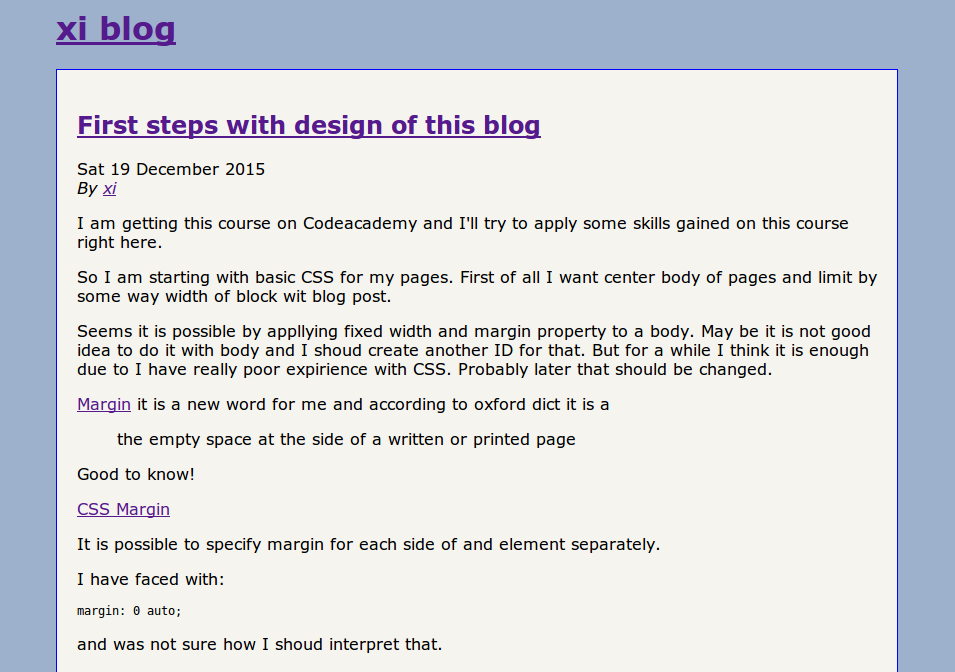

Title: First steps with design of this blog
Date: 2015-12-19
Category: Web desing
Tags: HTML, CSS

I am getting this course on [HTML & CSS | Codecademy](https://www.codecademy.com/learn/web) and I'll try to apply some skills gained on this course right here.

So I am starting with basic CSS for my pages.
First of all I want center body of pages and limit by some way width of block wit blog post.

Seems it is possible by appllying fixed width and margin property to a body.
May be it is not good idea to do it with body and I shoud create another ID for that. But for a while I think it is enough due to I have really poor expirience with CSS.
Probably later that should be changed.

[Margin](http://www.oxfordlearnersdictionaries.com/definition/english/margin?q=margin) it is a new word for me and according to oxford dict it is a
> the empty space at the side of a written or printed page

Good to know!

[CSS Margin](http://www.w3schools.com/css/css_margin.asp)

It is possible to specify margin for each side of and element separately.

I have faced with:

```
margin: 0 auto;
```
and was not sure how I shoud interpret that.

But according to example from documentation:

```
margin: 25px 50px;
    top and bottom margins are 25px
    right and left margins are 50px
```

It sets `0` for `top and bottom` and `auto` for `right and left` borders.

Related question [css - What does auto do in margin:0 auto? - Stack Overflow](http://stackoverflow.com/questions/3170772/what-does-auto-do-in-margin0-auto)

I'll reffer to SO for a abilty to refresh knowledge quickly in future.

I've just remembered some distinction in meaning of possibility and opportunity in english. I need to check it later.

So if we want to center element horizontally we need additionaly set width to elemtent.

[html - Why can't I center with margin: 0 auto? - Stack Overflow](http://stackoverflow.com/questions/963636/why-cant-i-center-with-margin-0-auto)


Some informaton about CSS units for expressing a length:
[CSS Units](http://www.w3schools.com/cssref/css_units.asp)

```
em
Relative to the font-size of the element (2em means 2 times the size of the current font)
```

>The CSS padding properties define the white space between the element content and the element border.

It is possible to specify padding for each side of and element separately too. There is same approach.

[CSS Padding](http://www.w3schools.com/css/css_padding.asp)

Border settings

[CSS Borders](http://www.w3schools.com/css/css_border.asp)

Shorten code to set up all proberties simultaneously:

```
    border-width
    border-style (required)
    border-color

    p {
        border: 5px solid red;
    }
```

For now it looks:

